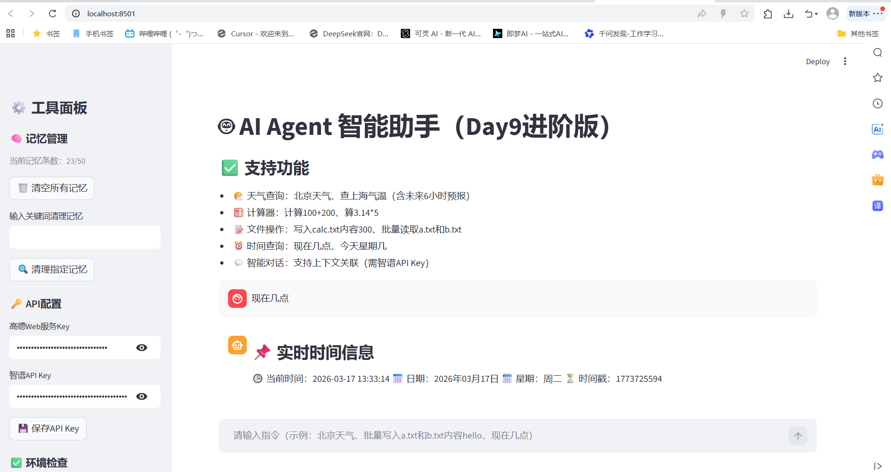

# Day9 AI Agent 智能助手进阶计划（基于Day8基础）

核心目标：基于 Day8 已实现的「Streamlit可视化+高德地理编码+Open-Meteo天气+计算器+文件操作+对话记忆」基础，完成**功能进阶、代码规范、部署测试** 三大模块，提升Agent的实用性、可维护性和稳定性，为后续复杂Agent开发铺垫。

前置准备：确保Day8代码可正常运行（Streamlit界面、天气查询、计算器、文件操作功能无报错），已配置高德Web服务Key、智谱API Key，本地Git仓库正常，.env文件已忽略。

## 一、今日整体时间规划（建议8-10小时，可灵活调整）

|时间段|核心任务|预计耗时|核心目标|
|---|---|---|---|
|09:00-10:30|代码复盘+规范优化|1.5小时|梳理Day8代码冗余，统一代码规范，提升可读性|
|10:40-12:00|功能进阶1：天气查询优化（新增预报+异常优化）|1.5小时|新增未来24小时天气预报，优化高德Key配置|
|14:00-15:30|功能进阶2：工具扩展（新增时间查询+批量文件操作）|1.5小时|新增实时时间查询，支持批量读取/写入文件|
|15:40-17:00|功能进阶3：对话记忆优化（上下文关联+记忆清理）|1.2小时|实现上下文关联对话，优化记忆清理功能|
|17:10-18:30|部署测试（本地部署优化+异常测试）|1.2小时|优化启动脚本，完成全场景异常测试，修复bug|
|19:30-20:30|代码提交+Day9笔记整理|1小时|规范提交代码，整理Day9进阶笔记，总结问题与解决方案|
## 二、具体任务拆解（含操作步骤+验收标准）

### 模块1：代码复盘与规范优化（09:00-10:30）

#### 1.1 代码复盘（30分钟）

- 梳理Day8代码结构，标记冗余部分：如重复的异常捕获逻辑、未注释的函数、变量命名不规范的地方；

- 检查核心函数：query_weather、calculator、file_operation、agent_core，确认无逻辑漏洞（如天气查询的经纬度解析、计算器的正则匹配）；

- 确认Streamlit界面交互：对话历史保存、侧边栏功能、输入容错是否正常。

#### 1.2 代码规范优化（1小时）

- 命名规范：统一变量、函数命名（小写+下划线，如 weather_map → WEATHER_MAP，file_oper → file_operation），避免拼音、模糊命名；

- 注释优化：给每个函数添加文档字符串（说明功能、参数、返回值），关键代码行添加注释（如高德地理编码的请求逻辑、正则匹配的含义）；

- 冗余清理：提取公共函数（如异常捕获的通用逻辑、路径规范化函数），避免重复代码；

- 格式优化：统一代码缩进（4个空格），删除空行、冗余打印语句，确保代码整洁。

#### 验收标准

1. 所有函数均有文档字符串，关键逻辑有注释；2. 变量、函数命名规范，无拼音、模糊命名；3. 无重复代码，代码缩进统一；4. 运行代码无报错，功能正常。

### 模块2：功能进阶1 - 天气查询优化（10:40-12:00）

#### 2.1 新增未来24小时天气预报（1小时）

- 修改 query_weather 函数，在Open-Meteo请求中新增 hourly 参数（温度、降水、风速），获取未来24小时的每小时天气数据；

- 解析hourly数据，提取未来6小时（核心时段）的天气信息，格式化为清晰的markdown展示（如：14:00 晴 18℃，15:00 多云 17℃）；

- 优化返回结果排版，区分「实时天气」和「未来6小时预报」，提升可读性。

#### 2.2 高德Key配置优化（30分钟）

- 将高德Web服务Key写入.env文件，通过load_dotenv()读取，避免硬编码（如：AMAP_KEY=你的Key）；

- 添加高德Key有效性校验：在query_weather函数开头，判断Key是否为空、是否有效，无效则返回友好提示；

- 优化地理编码逻辑：支持模糊匹配（如“京”→“北京”，“沪”→“上海”），提升用户体验。

#### 验收标准

1. 输入“北京天气”，能返回实时天气+未来6小时预报；2. 高德Key从.env读取，无硬编码；3. 输入模糊城市名（如“京”）能正确匹配；4. Key无效时返回友好提示，不崩溃。

### 模块3：功能进阶2 - 工具扩展（14:00-15:30）

#### 3.1 新增实时时间查询工具（30分钟）

- 新建 time_query 函数：使用datetime模块，获取当前本地时间、日期、星期，格式化为清晰的展示（如：当前时间：2026-03-17 14:30:00 星期一）；

- 在agent_core函数中添加指令匹配：兼容“现在几点”“当前时间”“今天星期几”等口语化指令；

- 优化交互：时间查询结果添加emoji，提升可视化效果。

#### 3.2 新增批量文件操作工具（1小时）

- 扩展 file_operation 函数，支持批量读取多个文件（如“读取calc.txt和test.txt”）、批量写入内容（如“给calc.txt和test.txt写入hello”）；

- 优化正则匹配：支持“批量读取[文件1]和[文件2]”“批量写入[文件1]和[文件2]内容[内容]”等指令；

- 添加批量操作异常处理：部分文件操作失败时，返回成功/失败的详细信息，不影响整体操作。

#### 验收标准

1. 输入“现在几点”，能返回当前时间、日期、星期；2. 输入“批量读取calc.txt和test.txt”，能分别显示两个文件的内容和统计信息；3. 批量操作部分失败时，返回详细提示，不崩溃。

### 模块4：功能进阶3 - 对话记忆优化（15:40-17:00）

#### 4.1 实现上下文关联对话（40分钟）

- 优化 load_memory 函数：读取记忆时，保留最近10条对话（确保上下文连贯，同时避免记忆过大）；

- 修改 agent_core 函数：在普通对话（LLM调用）时，将历史记忆传入llm.invoke()，实现上下文关联（如“查北京天气”→“明天呢”，能识别“明天”指北京明天的天气）；

- 测试上下文关联：连续输入“查北京天气”“明天温度多少”，LLM能正确返回北京明天的温度（需确保智谱API Key有效）。

#### 4.2 记忆清理功能优化（40分钟）

- 在Streamlit侧边栏，新增“清理指定记忆”按钮：允许用户输入关键词，删除包含该关键词的记忆（如输入“北京天气”，删除所有与北京天气相关的记忆）；

- 优化“清除所有记忆”功能：清除后给出成功提示，同时重置会话历史（st.session_state.chat_history）；

- 添加记忆长度显示：在侧边栏显示当前记忆条数，提醒用户记忆容量。

#### 验收标准

1. 连续对话能实现上下文关联；2. 侧边栏能显示记忆条数，支持清除所有记忆、清除指定记忆；3. 记忆清理后，会话历史同步重置，重新查询无历史干扰。

### 模块5：部署测试（17:10-18:30）

#### 5.1 本地部署优化（30分钟）

- 创建启动脚本（start.bat 或 start.sh）：一键安装依赖、启动Streamlit界面（避免每次手动输入命令）；

- 优化启动参数：设置Streamlit默认端口（如8501）、禁止自动打开浏览器（可选）、设置服务器地址为0.0.0.0（允许局域网访问）；

- 添加环境检查：启动时检查依赖是否安装、API Key是否配置，缺失则给出提示。

#### 5.2 全场景异常测试（50分钟）

按以下场景测试，确保无崩溃、无异常，错误提示友好：

- 天气查询：输入不存在的城市、高德Key无效、Open-Meteo请求超时；

- 计算器：输入非法表达式（如100+、a+b）、除零、小数运算；

- 文件操作：路径不存在、无权限、批量操作部分失败、写入空内容；

- 对话记忆：记忆满、清理记忆后对话、上下文关联错误；

- 界面交互：空输入、连续多次输入、清除会话历史。

#### 5.3 bug修复（20分钟）

- 记录测试中出现的bug，逐一修复（如上下文关联失败、异常提示不友好、批量文件操作报错）；

- 修复后重新测试，确保所有bug解决，功能正常。

#### 验收标准

1. 启动脚本能一键启动，环境检查正常；2. 所有测试场景无崩溃，错误提示友好；3. 修复所有bug，核心功能（天气、计算器、文件、记忆）正常运行。

### 模块6：代码提交与笔记整理（19:30-20:30）

#### 6.1 代码提交（30分钟）

- 检查.gitignore文件，确保.env、agent_memory.json、__pycache__等文件已忽略；

- 执行git命令，规范提交：
        
git add .
        
git commit -m "Day9 作业提交：AI Agent 进阶优化
        
- 代码规范：统一命名、添加注释、清理冗余
        
- 天气优化：新增未来6小时预报、高德Key配置优化
        
- 工具扩展：新增时间查询、批量文件操作
        
- 记忆优化：上下文关联、记忆清理功能升级
        
- 部署优化：新增启动脚本、全场景异常测试"
        
git push origin main
      

- 验证提交结果：远程仓库代码更新，无敏感信息（.env未提交）。

#### 6.2 Day9笔记整理（30分钟）

- 整理Day9进阶内容：代码规范优化要点、新增功能的实现思路、遇到的bug与解决方案；

- 补充核心代码片段（如未来天气预报、批量文件操作、上下文关联逻辑）；

- 总结Day9收获与不足，规划Day10改进方向（如新增更多工具、优化LLM对话体验）。

#### 验收标准

1. 代码成功提交到远程，无敏感信息；2. 笔记内容完整，包含进阶要点、代码片段、问题总结；3. 明确Day10改进方向。

## 三、注意事项

- 敏感信息保护：始终确保.env文件不提交到远程，API Key（智谱、高德）不硬编码；

- 测试优先：每完成一个功能（如未来天气预报、批量文件操作），先测试再进行下一个，避免多个bug堆积；

- 代码备份：关键步骤（如代码规范优化、功能进阶）前，可提交一次代码，避免误操作导致代码丢失；

- 灵活调整：若某一模块耗时过长（如上下文关联），可适当压缩其他模块时间，优先保证核心功能完成。

## 四、Day9 目标达成标志

1. 代码规范：命名、注释、格式统一，无冗余代码；

2. 功能进阶：新增未来天气预报、时间查询、批量文件操作，天气查询适配国内网络；

3. 记忆优化：实现上下文关联对话，支持记忆清理（全部/指定）；

4. 部署测试：有启动脚本，全场景测试无bug，功能稳定；

5. 提交完成：代码提交到远程，笔记整理完毕。

## 五、Day10 预习方向（可选）

1. 工具扩展：新增翻译、词典查询功能；2. LLM优化：接入多轮对话模板，提升上下文理解能力；3. 界面美化：自定义Streamlit主题、添加加载动画；4. 远程部署：尝试将Agent部署到云服务器（如阿里云、腾讯云），实现公网访问。
