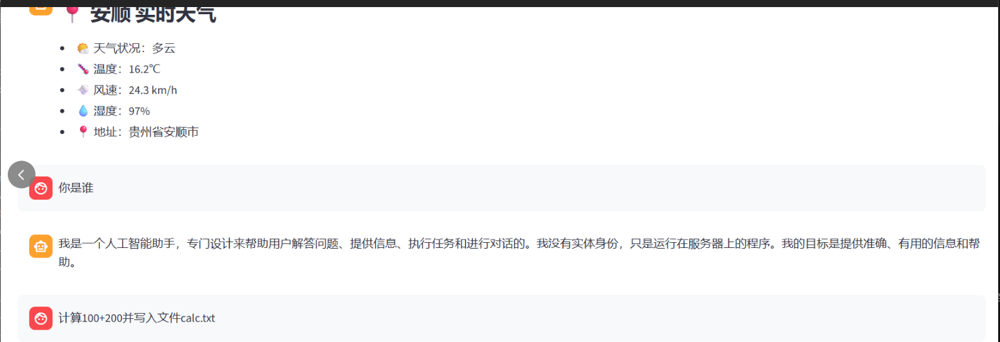

# Day8 AI Agent 智能助手开发笔记
## 一、开发背景与目标
### 1. 核心目标
开发一款具备**天气查询、计算器、文件操作、对话记忆**功能的AI Agent智能助手，通过Streamlit实现可视化交互，解决Gradio版本兼容问题，适配国内网络环境。

### 2. 技术栈
- 前端可视化：Streamlit（替代Gradio，解决版本兼容问题）
- 天气数据：高德地图地理编码（国内稳定）+ Open-Meteo（免费天气API）
- LLM能力：智谱GLM-4-Flash（需API Key）
- 核心工具：Python正则匹配、文件操作、JSON持久化

## 二、核心功能实现
### 1. Streamlit可视化界面搭建
#### （1）优势
- API稳定无版本兼容坑，核心组件（`st.chat_input`/`st.chat_message`）全版本通用；
- 原生支持聊天交互，无需复杂布局配置；
- 内置`st.session_state`管理会话状态，轻松实现对话历史。

#### （2）基础页面配置
```python
import streamlit as st

# 页面基础配置
st.set_page_config(
    page_title="🤖 AI Agent 智能助手",
    page_icon="🤖",
    layout="wide",
    initial_sidebar_state="collapsed"
)

# 初始化会话历史
if "chat_history" not in st.session_state:
    st.session_state.chat_history = []

# 聊天交互核心逻辑
user_input = st.chat_input("请输入指令（示例：北京天气、计算100+200）")
if user_input:
    # 显示用户输入
    with st.chat_message("user"):
        st.markdown(user_input)
    # 调用Agent核心逻辑
    response = agent_core(user_input)
    # 显示助手回复
    with st.chat_message("assistant"):
        st.markdown(response)
    # 保存会话历史
    st.session_state.chat_history.append({"role": "user", "content": user_input})
    st.session_state.chat_history.append({"role": "assistant", "content": response})
```

### 2. 高德地图+Open-Meteo天气查询
#### （1）问题背景
原生`nominatim.openstreetmap.org`地理编码服务国内访问超时，替换为高德地图Web服务（免费、稳定）。

#### （2）步骤1：申请高德Web服务Key
- 访问[高德开放平台](https://lbs.amap.com/) → 注册登录 → 创建应用 → 添加「Web服务」Key。

#### （3）步骤2：高德地理编码+Open-Meteo天气获取
```python
import requests

# 天气代码映射（标准化展示）
WEATHER_MAP = {
    0: "晴", 1: "晴", 2: "多云", 3: "阴",
    45: "雾", 48: "霜", 51: "小雨", 53: "中雨", 55: "大雨",
    61: "小雨", 63: "中雨", 65: "大雨", 71: "小雪", 73: "中雪", 75: "大雪",
    80: "阵雨", 81: "强阵雨", 82: "暴雨", 95: "雷暴", 96: "雷暴+冰雹", 99: "雷暴+冰雹"
}

def query_weather(city, amap_key="你的高德Web服务Key"):
    """高德地理编码 + Open-Meteo 天气查询"""
    if not city:
        return "❌ 请输入有效城市名（如：北京）"
    
    try:
        # 1. 高德地理编码获取经纬度
        geo_url = f"https://restapi.amap.com/v3/geocode/geo?address={city}&key={amap_key}"
        geo_res = requests.get(geo_url, timeout=8)
        geo_data = geo_res.json()
        if geo_data.get("status") != "1" or not geo_data.get("geocodes"):
            return f"❌ 未找到城市「{city}」"
        
        lon, lat = geo_data["geocodes"][0]["location"].split(",")
        lat, lon = float(lat), float(lon)

        # 2. Open-Meteo获取实时天气
        weather_url = (
            f"https://api.open-meteo.com/v1/forecast?"
            f"latitude={lat}&longitude={lon}&current_weather=true&hourly=relative_humidity_2m&timezone=Asia/Shanghai"
        )
        weather_res = requests.get(weather_url, timeout=8)
        data = weather_res.json()

        # 3. 解析并返回结果
        current = data["current_weather"]
        return f"""
### 📍 {city} 实时天气
- 🌤️ 天气：{WEATHER_MAP.get(current['weathercode'], '未知')}
- 🌡️ 温度：{current['temperature']}℃
- 💨 风速：{current['windspeed']} km/h
- 💧 湿度：{data['hourly']['relative_humidity_2m'][0]}%
        """
    except Exception as e:
        return f"❌ 天气查询失败：{str(e)}"
```

#### （4）备选方案：内置城市经纬度（无需高德Key）
```python
# 内置常用城市经纬度字典
CITY_COORDS = {
    "北京": (39.9042, 116.4074),
    "上海": (31.2304, 121.4737),
    "广州": (23.1291, 113.2644),
    # 可扩展更多城市...
}

def query_weather(city):
    """内置经纬度 + Open-Meteo 天气查询"""
    city_clean = city.replace("市", "").replace("区", "")
    if city_clean not in CITY_COORDS:
        return f"❌ 暂不支持城市「{city}」"
    
    lat, lon = CITY_COORDS[city_clean]
    # 后续Open-Meteo调用逻辑同上...
```

### 3. 核心工具模块
#### （1）智能计算器（容错+安全）
```python
import re

def calculator(expression):
    """支持数字+基础运算符，防格式错误/除零异常"""
    exp = expression.replace(" ", "")
    pattern = r"^(\d+\.?\d*)([\+\-\*\/])(\d+\.?\d*)$"
    match = re.match(pattern, exp)
    if not match:
        return "❌ 格式错误（示例：100+200、3.14*5）"
    
    num1, op, num2 = map(float, match.groups())
    if op == "/":
        if num2 == 0:
            return "❌ 除数不能为0"
        res = num1 / num2
    # 其他运算符逻辑...
    return f"### 🧮 计算结果\n`{exp} = {res}`"
```

#### （2）文件操作（读写+统计）
```python
import os

def file_operation(file_path, content=None, mode="read"):
    """文件读写+行数/字符数统计，处理权限/路径异常"""
    file_path = os.path.normpath(file_path)
    try:
        if mode == "write":
            # 确保目录存在
            dir_name = os.path.dirname(file_path)
            if dir_name and not os.path.exists(dir_name):
                os.makedirs(dir_name)
            with open(file_path, "w", encoding="utf-8") as f:
                f.write(content)
            return f"✅ 写入成功：{os.path.abspath(file_path)}"
        elif mode == "read":
            if not os.path.exists(file_path):
                return f"❌ 文件不存在"
            with open(file_path, "r", encoding="utf-8") as f:
                content = f.read()
                lines = len(f.readlines())
            return f"📄 内容：{content[:500]}...\n📊 行数：{lines}"
    except Exception as e:
        return f"❌ 操作失败：{str(e)}"
```

### 4. 对话记忆模块（JSON持久化）
```python
import json

MEMORY_FILE = "agent_memory.json"

def load_memory():
    """加载对话记忆，异常时重置"""
    try:
        if os.path.exists(MEMORY_FILE):
            with open(MEMORY_FILE, "r", encoding="utf-8") as f:
                return json.load(f)
        return []
    except:
        return []

def save_memory(role, content):
    """保存记忆，限制长度（避免文件过大）"""
    memory = load_memory()
    memory.append({"role": role, "content": content})
    if len(memory) > 100:
        memory = memory[-50:]  # 仅保留最后50条
    with open(MEMORY_FILE, "w", encoding="utf-8") as f:
        json.dump(memory, f, ensure_ascii=False, indent=2)
```

### 5. Agent核心逻辑（指令匹配+容错）
```python
def agent_core(user_input):
    """多指令匹配，兼容口语化表达"""
    user_input = user_input.strip().lower()
    save_memory("user", user_input)

    # 1. 天气查询（兼容：北京天气、查北京天气）
    if "天气" in user_input:
        city_matches = re.findall(r"(?:查)?\s*([^天气]+?)\s*天气", user_input)
        if city_matches:
            result = query_weather(city_matches[0].strip())
        else:
            result = "❌ 格式错误（示例：北京天气）"
    
    # 2. 计算器（兼容：计算100+200、算3.14*5）
    elif "计算" in user_input:
        exp_matches = re.findall(r"计算\s*([\d\.\+\-\*\/]+)", user_input)
        if exp_matches:
            result = calculator(exp_matches[0].strip())
        else:
            result = "❌ 格式错误（示例：计算100+200）"
    
    # 3. 文件操作/普通对话逻辑...
    
    save_memory("assistant", result)
    return result
```

## 三、关键问题与解决方案
| 问题 | 解决方案 |
|------|----------|
| Gradio版本兼容（Blocks/blocks属性缺失） | 替换为Streamlit，使用原生聊天组件，无版本坑 |
| 地理编码服务国内访问超时 | 替换为高德地图Web服务，或内置城市经纬度 |
| 指令匹配越界（IndexError） | 先判断正则匹配结果是否非空，再访问索引 |
| 代码崩溃（网络/格式/权限异常） | 全场景try-except捕获，返回友好错误提示 |
| 对话记忆过大 | 限制记忆长度，仅保留最后50条 |

## 四、运行与测试
### 1. 环境依赖安装
```bash
pip install streamlit requests langchain_community python-dotenv
```

### 2. 启动命令
```bash
streamlit run agent_app.py
```

### 3. 测试用例
| 输入指令 | 预期结果 |
|----------|----------|
| 北京天气 | 返回北京实时天气（温度/风速/湿度） |
| 计算100+200 | 返回「100+200 = 300」 |
| 写入calc.txt内容300 | 生成calc.txt文件，内容为300 |
| 读取calc.txt | 显示文件内容+行数统计 |

## 五、核心亮点
1. **兼容性**：Streamlit替代Gradio，彻底解决版本兼容问题；
2. **国内适配**：高德地理编码+Open-Meteo，天气查询稳定不超时；
3. **健壮性**：全异常捕获+指令容错，不会因输入/网络问题崩溃；
4. **用户体验**：口语化指令匹配、友好错误提示、会话记忆持久化；
5. **可扩展**：支持新增城市经纬度、扩展工具函数、配置LLM对话。

## 六、总结
本次开发核心是**解决环境兼容问题**（Gradio→Streamlit）和**适配国内网络**（高德地理编码），同时保证代码健壮性和用户体验。最终实现的AI Agent具备完整的工具能力和可视化交互，满足日常天气查询、计算、文件操作等需求，且具备对话记忆和异常容错能力。


运行效果图

